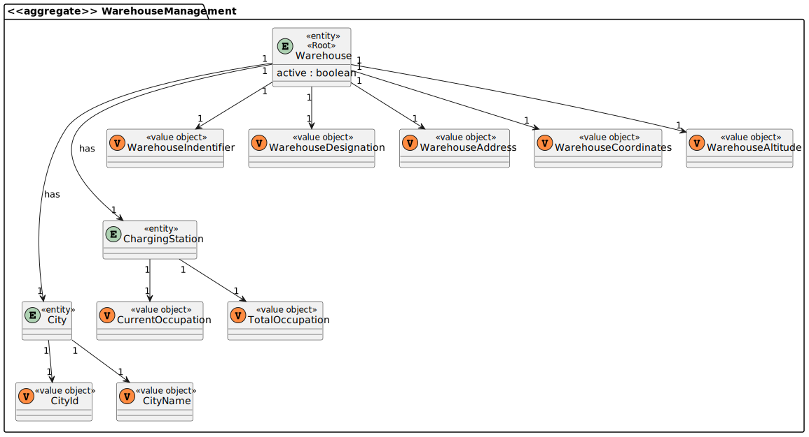
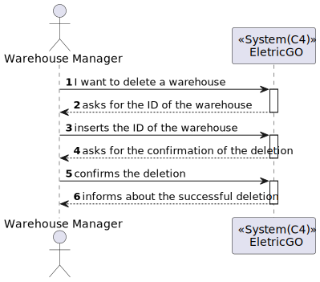
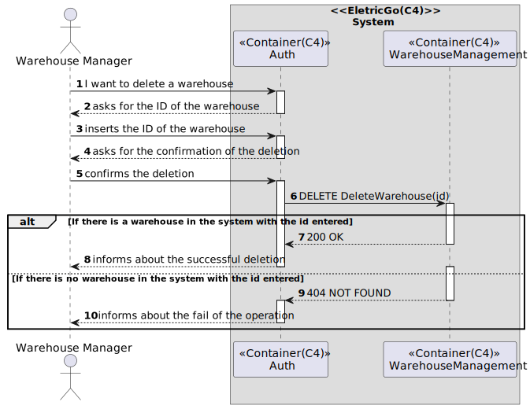
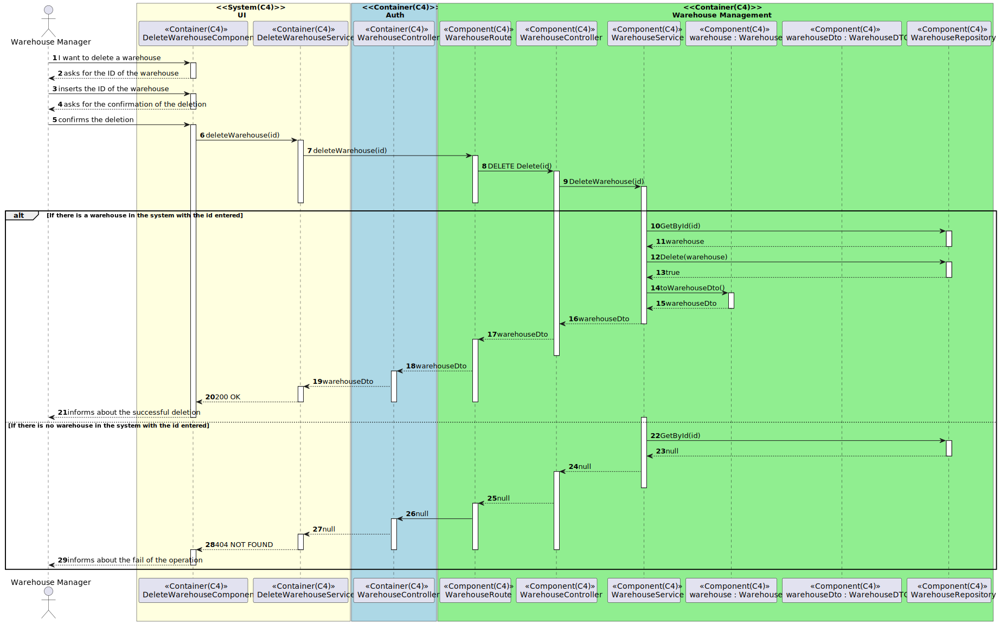
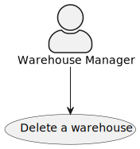
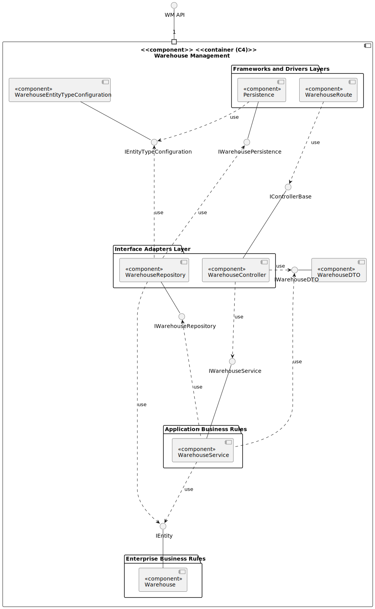
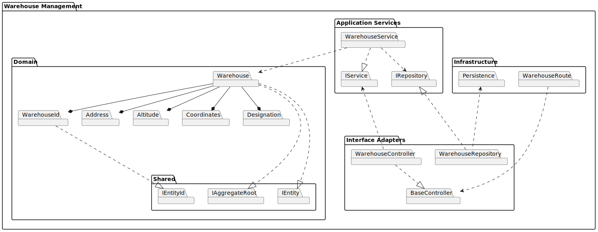

# US3.3.1-4.f- Como gestor de armazéns, pretendo inibir um armazém
=======================================

# 1. Requisitos

**US3.3.1-4.f** Como {Gestor de Armazém} pretendo...

- US3111a_SPA.1- Inibir um armazém

### 1.1 Especificações e esclarecimentos do cliente

> [Questão:](https://moodle.isep.ipp.pt/mod/forum/discuss.php?d=19869)
>Caro cliente,
>O que implica no sistema inibir um armazém? E o camião?
> 
> [Resposta:](https://moodle.isep.ipp.pt/mod/forum/discuss.php?d=19869)
> Bom dia
>ao inibir um camião ou armazém estamos a temporariamente desabilitar o uso desse camião ou armazém. Nesse sentido não podem ser considerados os camiões ou armazena inibidos no planeamento.
>No caso da visualização o armazém deve ser apresentado com um modelo diferente ou com outra indicação visual que se encontra inibido, por exemplo, um sinal de exclamação por cima do armazém

# 2. Análise

- Para a desenvolvimento deste caso de uso foram adotados as práticas de Domain Drive Design juntamente com a Arquitetura Onion.
- Para respeitar as práticas de DDD foram utilizadas classes de domínios que representam ValueObjects e classes que representam Entidades do nosso agregado.
- Relativamente a arquitetura Onion, o projeto foi desenvolvido com recurso a interfaces.

## Excerto do modelo de domínio

# 3. Design

- No contexto de domínio que nos foi proposto, consideramos que a entidade loja não faria sentido, visto que o papel seria o mesmo de um armazém, sendo assim, optamos por apenas representar o armazém no sistema.

## 3.1. Realização das Funcionalidades

### 3.1.1. Vista de Processos 

### Nível 1 
#### Inibir um armazém

### Nível 2
#### Inibir um armazém

### Nível 3
#### Inibir um armazém 

### 3.1.2. Vista de Cenários

### 3.1.3 Vista Lógica

### 3.1.3 Vista de Implementação

## 3.3. Testes
*Nesta secção deve sistematizar como os testes foram concebidos para permitir uma correta aferição da satisfação dos requisitos.*

### 3.3.1 Testes Unitários

**TEST**

# 4. Implementação

- Conforme o ‘design’ feito e com o agregado em questão apara o desenvolvimento desse caso de uso, os sequintes excertos de código abaixo servem para confirmar a veracidade do 'design' proposto.

### Component 

# 5. Demonstração da funcionalidade 

