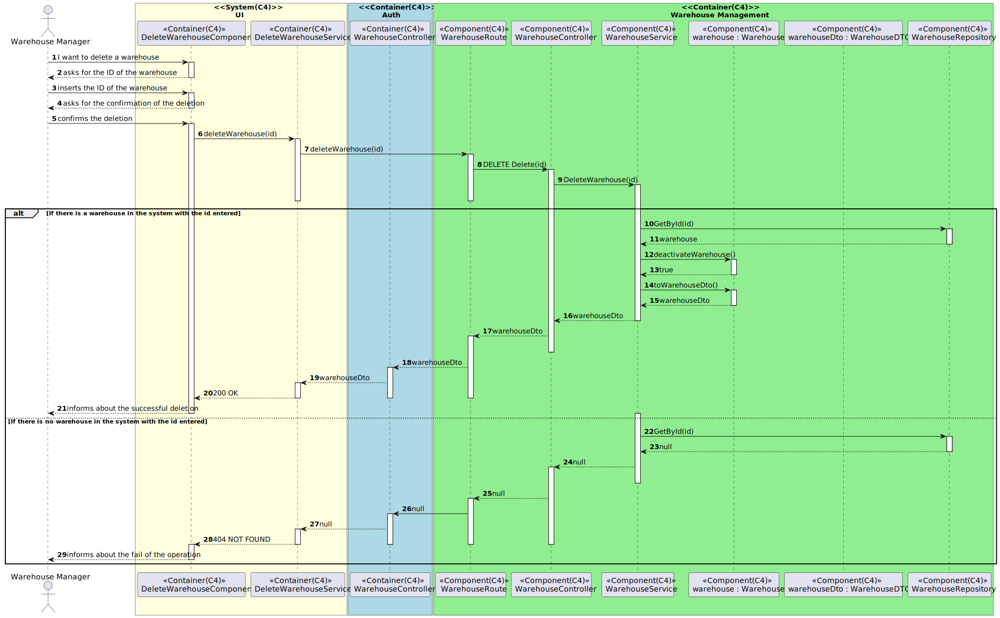

# US3.3.1-4.f- Como gestor de armazéns, pretendo inibir um armazém
=======================================

# 1. Requisitos

**US3.3.1-4.f** Como {Gestor de Armazém} pretendo...

- US3111a_SPA.1- Inibir um armazém

### 1.1 Especificações e esclarecimentos do cliente

> [Questão:](https://moodle.isep.ipp.pt/mod/forum/discuss.php?d=19869)
>Caro cliente,
>O que implica no sistema inibir um armazém? E o camião?
> 
> [Resposta:](https://moodle.isep.ipp.pt/mod/forum/discuss.php?d=19869)
> Bom dia
>ao inibir um camião ou armazém estamos a temporariamente desabilitar o uso desse camião ou armazém. Nesse sentido não podem ser considerados os camiões ou armazena inibidos no planeamento.
>No caso da visualização o armazém deve ser apresentado com um modelo diferente ou com outra indicação visual que se encontra inibido, por exemplo, um sinal de exclamação por cima do armazém

# 2. Análise

- Para a desenvolvimento deste caso de uso foram adotados as práticas de Domain Drive Design juntamente com a Arquitetura Onion.
- Para respeitar as práticas de DDD foram utilizadas classes de domínios que representam ValueObjects e classes que representam Entidades do nosso agregado.
- Relativamente a arquitetura Onion, o projeto foi desenvolvido com recurso a interfaces.

## Excerto do modelo de domínio

# 3. Design

- No contexto de domínio que nos foi proposto, consideramos que a entidade loja não faria sentido, visto que o papel seria o mesmo de um armazém, sendo assim, optamos por apenas representar o armazém no sistema.

## 3.1. Realização das Funcionalidades

### 3.1.1. Vista de Processos 

### Nível 1 
#### Inibir um armazém

### Nível 2
#### Inibir um armazém

### Nível 3
#### Inibir um armazém 

### 3.1.2. Vista de Cenários

### 3.1.3 Vista Lógica

### 3.1.3 Vista de Implementação

## 3.3. Testes
*Nesta secção deve sistematizar como os testes foram concebidos para permitir uma correta aferição da satisfação dos requisitos.*

### 3.3.1 Testes Unitários

**WarehouseService.spec.ts**

    it('should activate a warehouse', async () => {
        const response = {
        "status": 200,
        };

        const fetchSpy = spyOn<any>(service, 'sendFetch').and.returnValue(Promise.resolve(response));

        const status = await service.activateWarehouse('TH1');
        expect(fetchSpy).toHaveBeenCalled();
        expect(status.status).toEqual(200);
    });

    it('should deactivate a warehouse', async () => {
        const response = {
        "status": 200,
        };

        const fetchSpy = spyOn<any>(service, 'sendFetch').and.returnValue(Promise.resolve(response));

        const status = await service.activateWarehouse('TH1');
        expect(fetchSpy).toHaveBeenCalled();
        expect(status.status).toEqual(200);
    });

### 3.3.1 Testes End To End 

    it('should get the button edit in warehouses active', () => {

        cy.get('#active').then($active => {
        if($active){
            cy.get('button').contains('Edit');
        }
        })
    })

    it('should get the button activate in warehouses deactivated', () => {

        cy.get('#active').then($active => {
        if(!$active){
            cy.get('button').contains('Activate').click();
            cy.visit('http://localhost:4200/WarehouseManagement/Home/WarehouseManager');
        }

        })
    })

    it('should get the button deactivate in warehouses activated', () => {

        cy.get('#active').then($active => {
        if($active){
            cy.get('button').contains('Deactivate').click();
            cy.visit('http://localhost:4200/WarehouseManagement/Home/WarehouseManager');
        }

        })
    })

# 4. Implementação

- Conforme o ‘design’ feito e com o agregado em questão apara o desenvolvimento desse caso de uso, os sequintes excertos de código abaixo servem para confirmar a veracidade do 'design' proposto.

### WarehouseController.cs

        [HttpDelete("Delete/{id}")]
        public async Task<ActionResult<WarehouseDto>> Delete(string id)
        {
            var deletedObject = await _warehouseService.DeleteWarehouse(id);
            
            if (deletedObject == null)
            {
                return NotFound("The requested delete was not performed.");
            }

            return Ok(deletedObject);
            
            
        }

        [HttpPatch("Activate/{id}")]
        public async Task<ActionResult<WarehouseDto>> Activate(string id)
        {
            var ActivatedObject = await _warehouseService.ActivateWarehouse(id);
            
            if (ActivatedObject == null)
            {
                return NotFound("The requested ofr activate was not performed.");
            }

            return Ok(ActivatedObject);
            
        }

## WarehouseService.ts

    async activateWarehouse(warehouseId: string) {

        let url = this.urlOrigin+'api/warehouse/active/'+ warehouseId;
        if(this.urlOrigin.includes("azure")){
        url = 'https://auth57.azurewebsites.net/api/warehouse/activate/'+ warehouseId;
        }
        const response = await this.sendFetch(url,'PATCH',null);
        const data = await response.json();

        return data;
    
    }

    async deactivateWarehouse(warehouseId: string) {

            let url = this.urlOrigin+'api/warehouse/deactivate/'+ warehouseId;
            if(this.urlOrigin.includes("azure")){
            url = 'https://auth57.azurewebsites.net/api/warehouse/deactivate/'+ warehouseId;
            }
            const response = await this.sendFetch(url,'DELETE',null);
            const data = await response.json();

            return data;
        
    }

## Warehouse.cs 

    public void Deactivate()
    {
        this.active = false;
    }
    
    public void Activate(){
        this.active = true;
    }

# 5. Demonstração da funcionalidade 

- Para demostrar essa funcionalidade iremos a página 'Consult Warehouse', ao entrar nessa página serão mostradas todos os armazéns que encontram-se no sistema, e se estão ativos ou não.

- Caso o armazém encontre-se ativo, aparecerá a opção de desativar o armazém, caso contrário aparecerá a opção de ativar o armazém.
- Para demostração, iremos ativar o armazém de id "WH1" e desativar o armazém de id "WH2".

