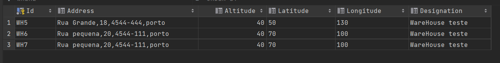
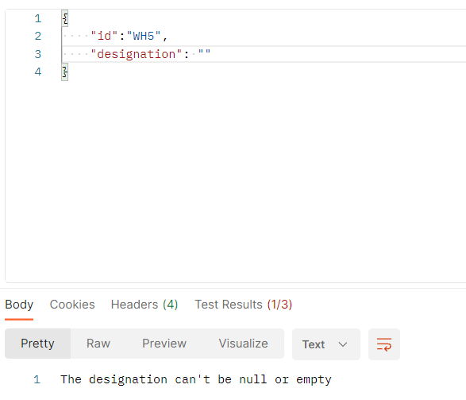

# US3111a - Como Gestor de Armazém, quero Criar, Listar e Editar um Armazém.
=======================================

# 1. Requisitos

**US3111a** Como {Gestor de Armazém} pretendo...

- US3111a.1- Criar armazéns
- US3111a.2- Listar os armazéns do sistema
- US3111a.2- Editar armazéns

### 1.1 Especificações e esclarecimentos do cliente

> [Question:](https://moodle.isep.ipp.pt/mod/forum/discuss.php?d=18704)
> Caro Cliente,
>Dentro das informações do Armazém (Id, Designação, Endereço, Coordenadas, Altitude) qual/quais são editáveis?
>
> [Answer:](https://moodle.isep.ipp.pt/mod/forum/discuss.php?d=18704)
>boa tarde,
a identificação do armazém não é editavel. a restante informação é.

> [Question:](https://moodle.isep.ipp.pt/mod/forum/discuss.php?d=18662)
>Caro Cliente,
Gostaríamos de saber se existem algumas restrições relativamente ao endereço, designação e identificação que a empresa especifique (como tamanho, formato, entre outros)? Se não, entendemos que as restrições são puramente as do "mundo real" - ex: moradas não podem ter numero negativos ou códigos postais devem corresponder ao formato 4 digitos - 3 digitos.
> 
> [Answer:](https://moodle.isep.ipp.pt/mod/forum/discuss.php?d=18662)
>bom dia,
>o endereço segue as regras de endereços postais Portugueses devendo consistir na morada, localidade e código postal, ex:
>
>Rua Dr. António Bernardino de Almeida, 431
>4249-015 Porto
>Portugal
> 
>a identificação do armazém é um código alfanumérico obrigatório com 3 caracteres.
> 
>a designação é um texto obrigatório com um máximo de 50 caracteres. normalmente será o nome da cidade/localidade onde o armazém está colocado

> [Question:](https://moodle.isep.ipp.pt/mod/forum/discuss.php?d=18958)
> Porque atributos gostaria que a filtragem dos armazéns fosse feita?
> 
> [Awnser:](https://moodle.isep.ipp.pt/mod/forum/discuss.php?d=18958)
>bom dia,
pelo seu identificador e designação.

# 2. Análise

- Para a desenvolvimento deste caso de uso foram adotados as práticas de Domain Drive Design juntamente com a Arquitetura Onion.
- Para respeitar as práticas de DDD foram utilizadas classes de domínios que representam ValueObjects e classes que representam Entidades do nosso agregado.
- Relativamente a arquitetura Onion, o projeto foi desenvolvido com recurso a interfaces.

## Excerto do modelo de domínio

# 3. Design

- No contexto de domínio que nos foi proposto, consideramos que a entidade loja não faria sentido, visto que o papel seria o mesmo de um armazém, sendo assim, optamos por apenas representar o armazém no sistema.

## 3.1. Realização das Funcionalidades

### 3.1.1. Vista de Processos 

### Nível 1 
#### Criar um novo armazém

#### Excluir um armazém

#### Consultar um armazém

#### Atualizar as informações de um armazém

#### Listar os armazéns

### Nível 2

#### Criar um novo armazém

#### Excluir um armazém

#### Consultar um armazém

#### Atualizar a informação de um armazém

#### Listar os armazéns

### Nível 3

#### Criar um novo armazém

#### Excluir um armazém

#### Consultar um armazém

#### Atualizar a informação de um armazém

#### Listar os armazéns

### 3.1.2. Vista de Cenários

### 3.1.3 Vista Lógica

### 3.1.3 Vista de Implementação

## 3.3. Testes
*Nesta secção deve sistematizar como os testes foram concebidos para permitir uma correta aferição da satisfação dos requisitos.*

### 3.3.1 Wep API Testes 

* Os testes de Web API encontram-se nesta [pasta](./resources/Warehouse%20Tests.postman_collection.json).

**Teste 1:** Verificar que não é possível criar uma instância da classe Exemplo com valores nulos.

	@Test(expected = IllegalArgumentException.class)
		public void ensureNullIsNotAllowed() {
		Exemplo instance = new Exemplo(null, null);
	}

# 4. Implementação

- Conforme o ‘design’ feito e com o agregado em questão apara o desenvolvimento desse caso de uso, os sequintes excertos de código abaixo servem para confirmar a veracidade do 'design' proposto.

### Warehouse

     public class Warehouse : Entity<WarehouseId>, IAggregateRoot
    {
        
        private Address Address { get; set; }
        private Altitude Altitude { get; set; }
        private Coordinates Coordinates{ get; set; }
        private Designation Designation { get; set; }
    }

### Warehouse Service 

    public class WarehouseService : IServices
    {
        private readonly IUnitOfWork _unitOfWork;
        private readonly IWarehouseRepository _warehouseRepository;
        

        public WarehouseService(IUnitOfWork unitOfWork, IWarehouseRepository warehouseRepository)
        {
            _unitOfWork = unitOfWork;
            _warehouseRepository = warehouseRepository;
        }

        public async Task<List<WarehouseDto>> GetWarehouses()
        {
            var warehouses = await _warehouseRepository.GetAll();
            return warehouses.Select(x => x.ToWarehouseDto()).ToList();
        }
    }

### Warehouse Controller

    public class WarehouseController : ControllerBase
    {
        private readonly WarehouseService _warehouseService;

        public WarehouseController(WarehouseService warehouseService)
        {
            _warehouseService = warehouseService;
        }

        [HttpGet("GetAll")]
        public async Task<ActionResult<List<WarehouseDto>>> Get()
        {
            List<WarehouseDto> dto = await _warehouseService.GetWarehouses();
            if (dto == null) return NotFound("Warehouses not found");

            return dto;
        }
    }
# 5. Demonstração da funcionalidade 

- Iremos demostra a funcionalidade de atualizar os dados de um armazém no sistema.
- Primeiro, começamos por verificar que já existem três armazéns no sistema, iremos utilizar o armazém com ID "WH5" para essa demostração.

- Iremos atualizar a descrição do armazém WH5, esse atributo não pode ter um tamanho maior do que 50 caracteres.

  

