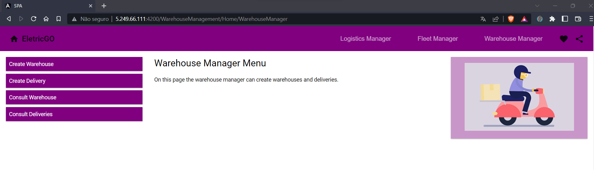

# US3111a_SPA - Como Gestor de Armazém, quero Criar, Listar e Editar um Armazém.
=======================================

# 1. Requisitos

**US3111a_SPA** Como {Gestor de Armazém} pretendo...

- US3111a_SPA.1- Criar armazéns
- US3111a_SPA.2- Listar os armazéns do sistema
- US3111a_SPA.2- Editar armazéns

### 1.1 Especificações e esclarecimentos do cliente

> [Question:](https://moodle.isep.ipp.pt/mod/forum/discuss.php?d=18704)
> Caro Cliente,
>Dentro das informações do Armazém (Id, Designação, Endereço, Coordenadas, Altitude) qual/quais são editáveis?
>
> [Answer:](https://moodle.isep.ipp.pt/mod/forum/discuss.php?d=18704)
>boa tarde,
a identificação do armazém não é editavel. a restante informação é.

> [Question:](https://moodle.isep.ipp.pt/mod/forum/discuss.php?d=18662)
>Caro Cliente,
Gostaríamos de saber se existem algumas restrições relativamente ao endereço, designação e identificação que a empresa especifique (como tamanho, formato, entre outros)? Se não, entendemos que as restrições são puramente as do "mundo real" - ex: moradas não podem ter numero negativos ou códigos postais devem corresponder ao formato 4 digitos - 3 digitos.
> 
> [Answer:](https://moodle.isep.ipp.pt/mod/forum/discuss.php?d=18662)
>bom dia,
>o endereço segue as regras de endereços postais Portugueses devendo consistir na morada, localidade e código postal, ex:
>
>Rua Dr. António Bernardino de Almeida, 431
>4249-015 Porto
>Portugal
> 
>a identificação do armazém é um código alfanumérico obrigatório com 3 caracteres.
> 
>a designação é um texto obrigatório com um máximo de 50 caracteres. normalmente será o nome da cidade/localidade onde o armazém está colocado

> [Question:](https://moodle.isep.ipp.pt/mod/forum/discuss.php?d=18958)
> Porque atributos gostaria que a filtragem dos armazéns fosse feita?
> 
> [Awnser:](https://moodle.isep.ipp.pt/mod/forum/discuss.php?d=18958)
>bom dia,
pelo seu identificador e designação.

# 2. Análise

- Para a desenvolvimento deste caso de uso foram adotados as práticas de Domain Drive Design juntamente com a Arquitetura Onion.
- Para respeitar as práticas de DDD foram utilizadas classes de domínios que representam ValueObjects e classes que representam Entidades do nosso agregado.
- Relativamente a arquitetura Onion, o projeto foi desenvolvido com recurso a interfaces.

## Excerto do modelo de domínio

# 3. Design

- No contexto de domínio que nos foi proposto, consideramos que a entidade loja não faria sentido, visto que o papel seria o mesmo de um armazém, sendo assim, optamos por apenas representar o armazém no sistema.

## 3.1. Realização das Funcionalidades

### 3.1.1. Vista de Processos 

### Nível 1 
#### Criar um novo armazém

#### Atualizar as informações de um armazém

#### Listar os armazéns

### Nível 2

#### Criar um novo armazém

#### Atualizar a informação de um armazém

#### Listar os armazéns

### Nível 3

#### Criar um novo armazém

#### Atualizar a informação de um armazém

#### Listar os armazéns

### 3.1.2. Vista de Cenários

### 3.1.3 Vista Lógica

### 3.1.3 Vista de Implementação

## 3.3. Testes
*Nesta secção deve sistematizar como os testes foram concebidos para permitir uma correta aferição da satisfação dos requisitos.*

### 3.3.1 Testes de Integração

**WarehouseController**

    [Test]
    public async Task PostTest()
    {
        var warehouse = new EletricGo.Domain.Warehouses.Warehouse(new WarehouseId(id + "1"), new Address(address),
        new Altitude(altitude), new Coordinates(latitude, longitude), new Designation(description));
        var warehouseExpected = warehouse.ToWarehouseDto();

        var mockUnit = new Mock<IUnitOfWork>();
        var mockRepository = new Mock<IWarehouseRepository>();

        var mockRepo = new Mock<IWarehouseRepository>();
        mockRepo.Setup(repo => repo.Add(warehouse)).ReturnsAsync(warehouse);
        mockRepository.Setup(repo => repo.GetByID(new WarehouseId(id + "1"))).ReturnsAsync(null as EletricGo.Domain.Warehouses.Warehouse);
        var mockUnitRepo = new Mock<IUnitOfWork>();
        mockUnitRepo.Setup(repo => repo.CommitAsync());

        var service = new WarehouseService(mockUnitRepo.Object, mockRepo.Object);
        var controller = new WarehouseController(service);

        var aux = await controller.Post(warehouseExpected);

        if (aux == null)
            Assert.Fail();
        else
        {
            var warehouseResult = ((WarehouseDto)(aux.Result as CreatedAtActionResult).Value);

            Assert.That(warehouseResult.Id, Is.EqualTo(warehouseExpected.Id));
        }
    }

### 3.3.2 Testes Unitários

**Teste 1:** Verificar que não é possível criar uma instância da classe Address se o código postal não estiver no formato correto.

    [Test]
    public void CreatingAddressWithAInvalidZipCode()
    {
        var ex = Assert.Throws<BusinessRuleValidationException>(() => new Address("Rua António Bernardino,47,45375-334,Porto"));
        Assert.That(ex.Message, Is.EqualTo("The zip code isn't in the right format"));
    }

**Teste 2:** Verificar que não é possível criar uma instância da classe WarehouseId se o id não for alfanumérico.
    
     [Test]
    public void CreatingWarehouseIdWithJustNumericCharacters()
    {
        var ex = Assert.Throws<BusinessRuleValidationException>(() => new WarehouseId("111"));
        Assert.That(ex.Message, Is.EqualTo("The Id must be alphanumeric"));
    }
    
    [Test]
    public void CreatingWarehouseIdWithJustAlphabeticCharacters()
    {
        var ex = Assert.Throws<BusinessRuleValidationException>(() => new WarehouseId("CCC"));
        Assert.That(ex.Message, Is.EqualTo("The Id must be alphanumeric"));
    }

# 4. Implementação

- Conforme o ‘design’ feito e com o agregado em questão apara o desenvolvimento desse caso de uso, os sequintes excertos de código abaixo servem para confirmar a veracidade do 'design' proposto.

### Warehouse Controller - Auth 

    async editWarehouse(req: Request, res: Response, next: NextFunction) {
        const httpAgent = new http.Agent({ rejectUnauthorized: false });

        const url = 'https://localhost:5001/api/warehouses/Update';
        
        const response = await fetch(url, {
          method: 'PUT',
          body: JSON.stringify(req.body),
          headers: {
            'Content-Type': 'application/json'
          },
          agent: httpAgent
        })
    
        if(response.status != 200){
          res.status(response.status);
          return res.json({message: "Error updating warehouse"});
        }
    }

### Warehouse Service - UI 

    async updateWarehouse(warehouse: any) {
    
        const url = this.urlOrigin+'api/warehouse/update';
        
        const data = warehouse;
        
        const response = await fetch(url, {
          method: 'PUT',
          body: JSON.stringify(data),
          headers: {
            'Content-Type': 'application/json'
          },
        })
        
        return response;
    
    }

### Warehouse Component 

    async onSubmit() {
        let answer = await this.warehouseService.createWarehouse(this.formCreateWarehouse.value);
        let message = "Warehouse created successfully";
        
        if(answer.status != 201){
          message = "Error creating warehouse";
        }
        const dialogRef = this.dialog.open(CreateWarehouseComponentDialog, {
          width: '250px',
          data: {
            name: this.formCreateWarehouse.value.Id,
            message: message},
        
        });
        
        dialogRef.afterClosed().subscribe(result => {
          if(answer.status == 200)
            this.router.navigate(['Logistics/Home/WarehouseManager']);
          
        });
    }
# 5. Demonstração da funcionalidade 

- Iremos demostra a funcionalidade de atualizar os dados de um armazém no sistema.
- Primeiro, iremos aceder a [URL](http://5.249.66.111:4200/WarehouseManagement/Home/WarehouseManager) associada a atualização de um armazém, iremos nos deparar com a seguinte página web.

- De seguida iremos consultar todos os armazéns disponíveis no sistema e selecionaremos o que queremos atualizar.

- Iremos atualizar o armazém de id 'TH1' e atualizaremos a sua altitude, recordo que a altitude de um armazém não pode ser negativa, caso o utilizador introduza um número negativo o armazém não será atualizado.

