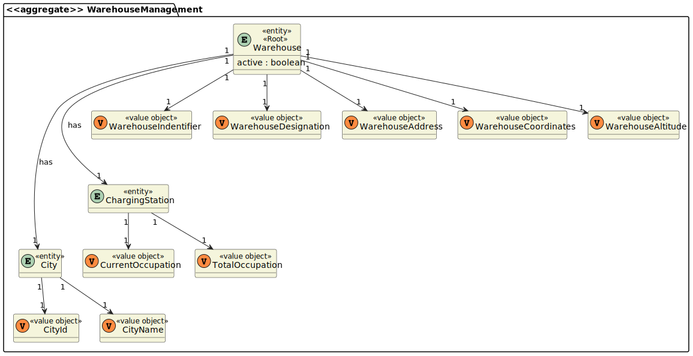
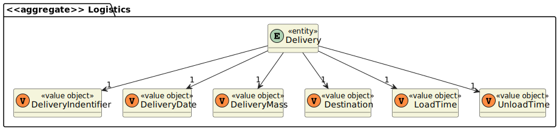
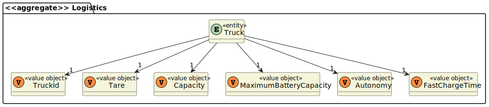
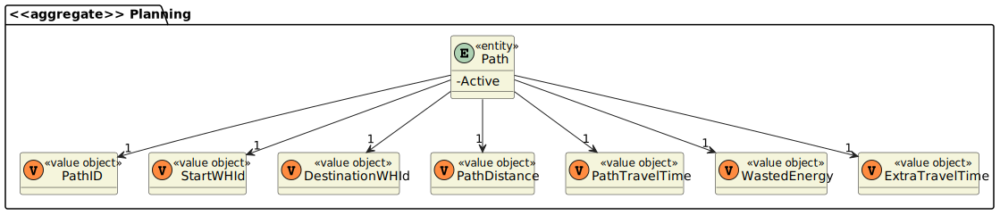

# Servidor PROLOG 
=======================================

# 1. Requisitos
Para existir comunicação entre os módulos do _Warehouse Management_ e da _Logistics_ foi necessário a criação de um servidor PROLOG que pudesse tanto receber como mandar pedidos a esses servidores.
Essa necessidade dá-se porquê é necessário que a informação esteja sempre coerente tanto no nosso domínio como na base de conhecimento dinâmica que será criada no servidor PROLOG.

# 2. Análise

- Para desenvolvermos essa funcionalidade será necessário mapear os objetos que encontram-se na base de dados para a base de conhecimento.

- Existem quatro factos que serão cruciais para o desenvolvimento dos predicados resiquisitados, são esses factos:

    - idArmazem(_local_,_codigo_)

    - entrega(_idEntrega_,_data_,_massaEntrega_,_armazemEntrega_,_tempoColoc_,_tempoRet_)

    - carateristicasCam(_nome_camiao_,_tara_,_capacidade_carga_,_carga_total_baterias_,_autonomia_,_t_recarr_bat_20a80_)

    - dadosCam_t_e_ta(_nome_camiao_,_cidade_origem_,_cidade_destino_,_tempo_,_energia_,_tempo_adicional_)

- Cada um desses factos corresponde a um entidade do domínio, tendo sido os armazéns e as entregas criados no módulo _Warehouse Management_ e os caminhos e os camiões no módulo _Logistics_.

- Os objetos salvaguradados na base de dados, possuem atributos ligeiramente diferente dos factos que serão necessários na utilização dos predicados, ou seja, terá de existir um mapeamento entre os objetos do domínio e os factos que serão criados.

# 3. Design

### Mapeamento dos Armazéns e das Cidades 
- Os armazéns e as cidades foram concebidos da seguinte forma no nosso sistema:
#### Armazéns

 
- Na base de conhecimento o facto _idArmazem_ serão as cidades que encontram-se persistidas na base de dados. Para esse facto não foi necessário um grande esforço, visto que o facto necessita de um _local_ e um _codigo_, e esses dois atributos correspondem respectivamente ao _CityName_ e ao _CityId_.

- Em relação aos armazéns, foi necessário a criação desse facto adicional na base de conhecimento pois, os caminhos tem como destino e origem o id de um armazém.
- O facto _armazem_ tem a seguinte estrutura: armazem(_id_, _address_, _altitude_, _latitude_, _longitude_, _designation_, _cityId_) tal como a proposta pelo modelo de domínio. 

### Mapeamento de Entregas 
- As entregas foram mapeadas da seguinte forma no nosso sistema:
#### Entregas

- Na base de conhecimento o facto _entrega_ serão as entregas que encontram-se persistidas na base de dados. Para esse facto não foi necessário um grande esforço, visto que o facto necessita de um _idEntrega_, uma _data_, uma _massaEntrega_, um _armazemEntrega_, um _tempColoc_ e um _tempoRet_ e atributos correspondem respectivamente ao _DeliveryIdentifier_, _DeliveryDate_, _DeliveryMass_, _Destination_, _LoadTime_, _UnloadTime_ .

### Mapeamento de Camiões
- Os camiões foram mapeadas da seguinte forma no nosso sistema:
#### Camiões

- Na base de conhecimento o facto _caracteristicasCam_ serão os camiões que encontram-se persistidas na base de dados. Para esse facto não foi necessário um grande esforço, visto que o facto necessita de um _nome_camiao_, uma _tara_, uma _capacidade_carga_, uma _carga_total_baterias_, uma _autonomia_ e um _t_recarr_bat_20a80_ e atributos correspondem respectivamente ao _TruckId_, _Tare_, _Capacity_, _MaximumBatteryCapacity_, _Autonomy_, _FastChargeTime_.

### Mapeamento de Caminhos
- Os caminhos foram mapeadas da seguinte forma no nosso sistema:
#### Caminhos

- Na base de conhecimento o facto _dadosCam_t_e_ta_ serão mapeados com alguma informação relativa ao camião, porém, existiram alguma diferenças significativas, uma delas é a existencia de um camião associado ao facto _dadosCam_t_e_ta_ e na nossa base de dados um caminho não estar relacionado com um camião. 
- Para o Sprint B, como nos foram dadas indicações de que só haveria um camião a fazer entregas, na base de conhecimentos todos os factos _dadosCam_t_e_ta_ estão associados ao camião de id _eTruck01_.
- Outra questão será o mapeamento entre o atributo _StartWHId_ e o _DestinationWHId_ para os atributos _cidade_origem_, e _cidade_destino_. Esse mapeamento será feito da seguinte forma:

    - Iremos ao facto _armazem_ e passaremos _StartWHId_ e o _DestinationWHId_ ao qual pretendemos descobrir as cidades associadas;
    - Guardamos esses valores em variáveis no PROLOG e na criação dos factos _dadosCam_t_e_ta_ passaremos por parâmetro aos atributos _cidade_origem_ e _cidade_destino_ as cidades associadas aos armazéns de origem e destino. 

- Com exceção dos atríbutos mencionados acima, os restantes são de fácil mapemanto entre a entidade _Path_ e o facto _dadosCam_t_e_ta_.

# 4. Implementação

- Conforme o ‘design’ feito e com o agregado em questão apara o desenvolvimento desse caso de uso, os sequintes excertos de código abaixo servem para confirmar a veracidade do 'design' proposto.

### Mapeamento de Armazéns e Cidades  
  
    :- dynamic idArmazem/2.
    :- dynamic armazem/7.

    create_warehouse(Id, Address, Altitude, Latitude, Longitude, Designation, City, WarehouseJson):-
                    \+armazem(Id,_,_,_,_,_,_),
                    assertz(armazem(Id, Address, Altitude, Latitude, Longitude, Designation, City)),
                    warehouseprolog_tojson(Id, Address, Altitude, Latitude, Longitude, Designation, City, WarehouseJson).

    add_city(Id, Name, CityJson):- 
		\+idArmazem(_,Id), 
		assertz(idArmazem(Name, Id)), 
		cityprolog_tojson(Id, Name, CityJson).

### Mapeamento das entregas

    :- dynamic entrega/6.
    
    create_delivery(Id, Date, Mass, Destination, LoadTime, UnloadTime, DeliveryJson):-
				\+entrega(Id, _, _, _, _, _), 
				assertz(entrega(Id, Date, Mass, Destination, LoadTime, UnloadTime)), 
				deliveryprolog_tojson(Id, Date, Mass, Destination, LoadTime, UnloadTime, DeliveryJson).   

### Mapeamento dos camiões 
    
    :- dynamic caracteristicasCam/6.

    create_truck(Id, Tare, Capacity, BateryCapacity, Autonomy,TimeToCharge, TruckJson):-
			\+caracteristicasCam(Id, _, _, _, _, _), 
			assertz(caracteristicasCam(Id, Tare, Capacity, BateryCapacity, Autonomy, TimeToCharge)), 
			truckprolog_tojson(Id, Tare, Capacity, BateryCapacity, Autonomy, TimeToCharge, TruckJson).

### Mapeamento dos caminhos

    :- dynamic dadosCam_t_e_ta/6.

    create_path(Truck, CityDest, AditionalTime, PathTime, CityOrig, Energy, PathJson):-
			armazem(CityOrig,_,_,_,_,_,City),
			armazem(CityDest,_,_,_,_,_,City1),
			\+dadosCam_t_e_ta(_, City, City1, _, _, _),
			assertz(dadosCam_t_e_ta(Truck, City, City1, PathTime, Energy, AditionalTime)), 			
			pathprolog_tojson(Truck, City, City1, PathTime, Energy, AditionalTime, PathJson).